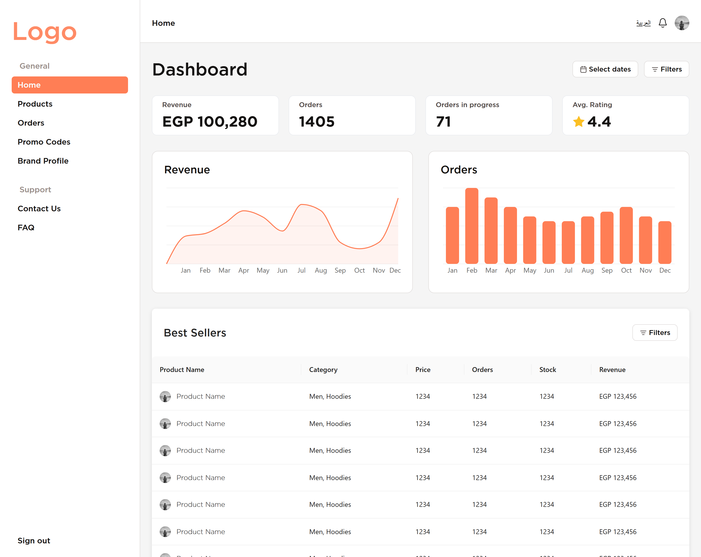
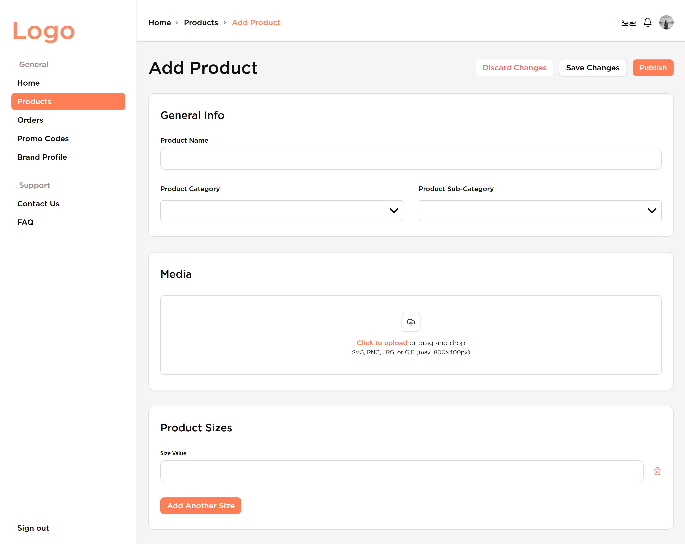
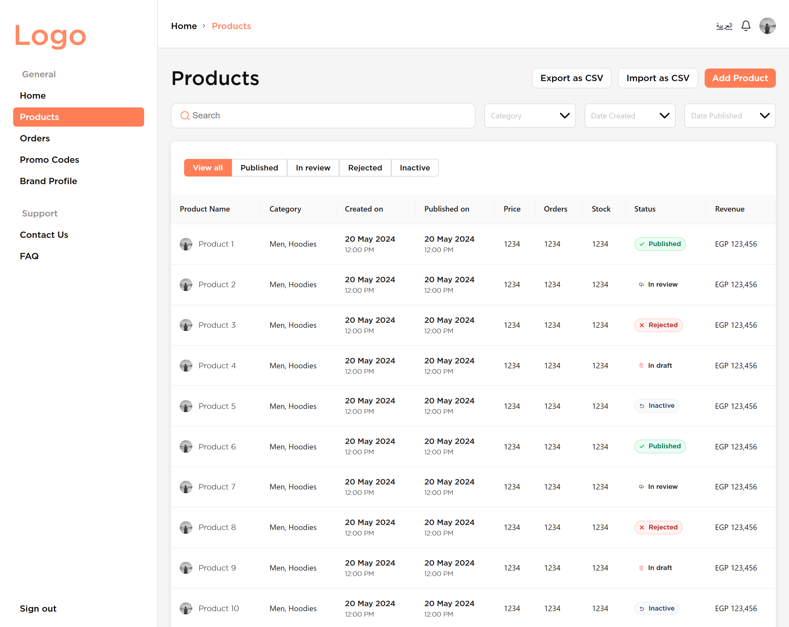

# 🚀 **Dashboard Vite Template**

This is a dashboard template built with React and Vite. It provides a modern and responsive user interface for building web applications. It includes:

- Forms with all shapes
- Sider
- Navbar
- Data tables
- Filters
- Graphs
- Search
- Uploads
- Translation using i18n
- Auth/main stacks
- An overall ready-for-integration template with an atomic design system.

## ✨ Features

- **[React](https://reactjs.org/)**: A JavaScript library for building user interfaces.
- **[Vite](https://vitejs.dev/)**: A fast build tool and development server.
- **[TypeScript](https://www.typescriptlang.org/)**: A strongly typed programming language that builds on JavaScript.
- **[Redux Toolkit](https://redux-toolkit.js.org/)**: A toolset for efficient Redux development.
- **[RTK Query](https://redux-toolkit.js.org/rtk-query/overview)**: Powerful data fetching and caching tool.
- **[React Toastify](https://fkhadra.github.io/react-toastify/)**: Easy-to-use toast notifications.
- **[React-i18next](https://react.i18next.com/)**: Internationalization for React.
- **[Day.js](https://day.js.org/)**: A lightweight JavaScript date library.
- **[Ant Design (Antd)](https://ant.design/)**: A popular React UI framework.
- **[React Hook Form](https://react-hook-form.com/)**: Performant, flexible, and extensible forms with easy-to-use validation.
- **[Atomic Design System](https://bradfrost.com/blog/post/atomic-web-design/)**: A methodology for creating design systems.
- **[Husky](https://typicode.github.io/husky/)** (optional): Git hooks made easy.
- **[ESLint](https://eslint.org/)** (optional): A tool for identifying and fixing problems in JavaScript code.
- **Reusable Components**: Modular and reusable components for easy customization.
- **State Management**: Integrated state management using React hooks or context.

## 🛠️ Installation

To get started with this project, follow these steps:

1. Install the Template:
   ```bash
   npx create-nova-vite-template
   ```
2. Navigate to the project directory:
   ```bash
   cd <project-name>
   ```
3. Install the dependencies:
   ```bash
   npm install
   ```

## 📚 Usage

To start the development server, run:

```bash
npm run dev
```

To build the project for production, run:

```bash
npm run build
```

To preview the production build, run:

```bash
npm run
```

## 📄 License

This project is licensed under the MIT License.

## 🤝 Contributing

Contributions are welcome! Please read the [contributing guidelines](CONTRIBUTING.md) first.

## 📋 Changelog

See the [CHANGELOG](CHANGELOG.md) for a history of changes to this project.

## 📸 Screenshots

Here are some screenshots of the application:


(screenshots/form2.png)

